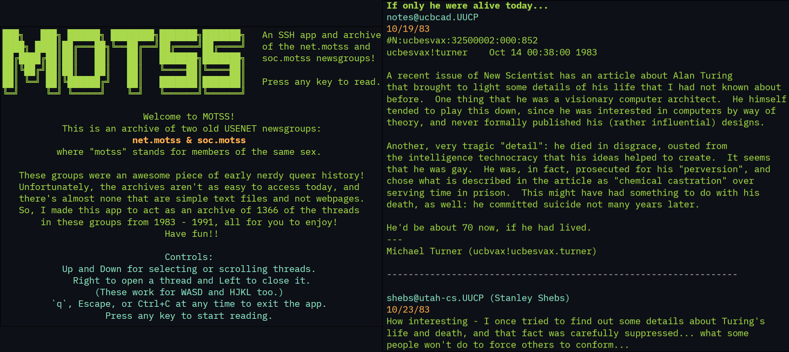

# MOTSS

**An SSH app and archive of the net.motss and soc.motss newsgroups**

An authentic way to experience early nerdy queer history!

## Installation and Usage

On any operating system, you can use the SSH app by opening a terminal and entering `ssh -p 25697 2.tcp.us-cal-1.ngrok.io`. Then type `yes`, press enter, and you're in!

If you want less lag or a local version of the archive, you can run the app locally. For Windows and Linux, there are downloadable versions in the Release page. Otherwise, you can clone the repo, install Go, and run `go run .` in the repository.

If you want to host the SSH server yourself, simply run `go run . ssh` and the server will be set up on 127.0.0.1:8000. You can choose the port with `go run . ssh [port]` and you can modify the address in the `main.go` file.
